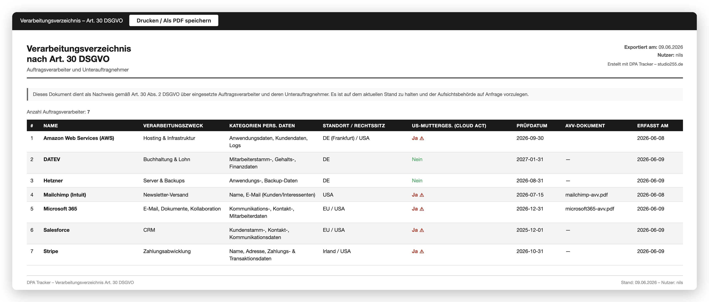

# DPA Tracker

A Nextcloud app for maintaining a GDPR Article 30 record of processing activities — track your data processing agreements (DPAs) and subprocessors directly inside your own Nextcloud, on your own infrastructure.

<!-- Add a screenshot once available:  -->

## Why

Most organizations keep their subprocessor list in a spreadsheet, and most "compliance SaaS" tools store that same sensitive data in yet another external cloud. DPA Tracker takes the opposite approach: your record of processing activities stays inside your Nextcloud instance and never leaves your infrastructure — no third-party SaaS, no external cloud, fully self-hosted.

For each subprocessor you capture the purpose of processing, the categories of personal data, the provider's location, and a CLOUD Act risk indicator (whether the provider has a US parent company). DPA documents can be attached, review dates tracked, and an audit-ready Article 30 record exported.

Designed for SMEs and public-sector organizations that need GDPR and NIS-2 documentation on sovereign infrastructure.

## Features

- Subprocessor register aligned with GDPR Article 30
- CLOUD Act risk indicator per provider (US parent company yes/no)
- Purpose of processing, categories of personal data, and provider location per entry
- Attach DPA documents from your Nextcloud files
- Track contract review dates
- Audit-ready export of the record of processing activities
- 100% self-hosted — data never leaves your Nextcloud

## Requirements

- Nextcloud 30 or later (see `appinfo/info.xml` for the exact supported range)
- PHP 8.1+

## Installation

### From the Nextcloud App Store

Coming soon. Once published, install directly via **Apps → Tools** in your Nextcloud.

### Manual / development

Clone into your Nextcloud `custom_apps` directory and enable the app:

```bash
cd /path/to/nextcloud/custom_apps
git clone https://github.com/studio255/dpatracker.git dpatracker
php occ app:enable dpatracker
```

## License

[AGPL-3.0-or-later](LICENSE)

## Author

[Studio255](https://studio255.de) — PHP & Nextcloud development, Karlsruhe.
Focused on digital sovereignty, cloud-exit migrations, and GDPR/NIS-2 tooling.